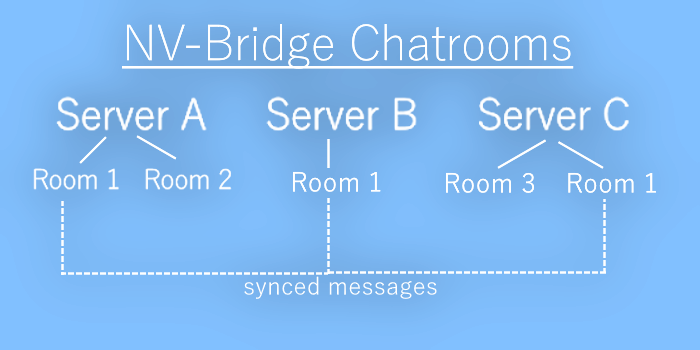

# 🤖 NeoVision Discord-Bot
A Discord-Bot written in Python with features like coin/economy system, music, memes, temporary channels, server-bridge, general moderation utilities and more!

## [✨ Add to your server](https://discord.com/oauth2/authorize?client_id=795743605221621782&scope=bot)
Click to add the bot to a Discord server of your choice (you need the corresponding permissions on the server). It's just 4 clicks (if there isn't any captcha or login screen)! Just select a server and click on go!

### Featured servers using this bot

## 💙 Support me & the bot
My bot is free to use and I would really appreciate support :) Thanks <3
### [🔼 Upvote on DBL](https://discordbotlist.com/bots/neovision)
If would really support me if you could take 20 seconds and upvote & rate my bot on *DiscordBotList*. You need to log into DBL using Discord.

### Disclaimer
The program contains a **`xmltodict.py`**. I DIDN'T CREATE IT. I just had problems with importing it, so I just decided to put it in here. The *xmltodict*-repo can be found at https://github.com/martinblech/xmltodict.

# 🔨 Installation
1. Execute in root dir: `pip install -r requirements.txt` to install the needed libaries.
2  After that, create a file in "\config" called "token.txt". The content of the file has to be the bot token (see the section "Security" > "Token") for security information.
3. Go to https://github.com/BtbN/FFmpeg-Builds/releases download `ffmpeg-n(VERSION)-win64-gpl-(VERSION).zip` and paste `/bin/ffmpeg.exe` to `C:/ffmpeg/ffmpeg.exe`.

## ⛔ Fix errors:
If you get "ERROR: Could not build wheels for multidict, yarl which use PEP 517 and cannot be installed directly":
- __(not recommended)__ Downgrade to Python 3.8.6 
- __(not recommended)__ Download the "cp39" (for Python 3.9)-Versions of:

    -**lfd.uci.edu/~gohlke/pythonlibs/#yarl**

    -**lfd.uci.edu/~gohlke/pythonlibs/#multidict**

    remember to choose the right win_amd64/win32-Version.

    And do `pip install `**FILENAME** (e.g *yarl-1.6.3-cp39-cp39-win_amd64.whl*)` --force-reinstall` in the directory you downloaded the files for **both the two files**. 

    Then try `pip install discord.py` or `pip install discord` again.

- __(recommended/best way)__ install **https://visualstudio.microsoft.com/visual-cpp-build-tools/** (this worked for me)

- alternatively, see: https://stackoverflow.com/a/64861883

Run the setup.bat or start.bat (see *usage*) and follow the instructions.

## 🛠️ Usage
Try running the bot from the root directory (meaning not "src"). If you are running on windows, I added a start.bat and setup.bat, they are self-explainitory.

# 🔒 Security note
This section will inform you about how you can safe your bot against black hat hackers/exploits etc.

## Permissions
Please go to the Discord Developer Portal `/applications/<application id>/bot` and scroll down to the section "Bot permissions". From there, tick all **needed and used** permissions. Do NOT tick "Administrator" - this will allow the bot to do almost everything on your server. And, do NOT tick unused permissions.

## Token
The bot token is secret! Everyone with access to the token can execute everything allowed to the bot (see "Permissions"). Therefore, remember to put the token.txt in the `.gitignore`, if you are using Git.

## ✔️ Features
Sorry if they aren't up to date. Keep in mind you can always use the command **`.help`** to get information about other commands. Use **`.command`**

How the syntax/scheme works:
- **Symbols:**
    - Values: `<value> <name>`
    - Choices: `[option1_OR|option2_OR|option3...]`
    - Optional arguments: `(optional) (argument)`
- **Examples:** `[say|tell] (<name>) <text>` can be filled out as `say nsde Hello!` or `tell Hello`.

### TempChannels
Create channels (text or voice) deleting themselves after a specific amount of time of user inactivity.

Inactivity means:
- no user being in a **voice** channel
- no message written in a **text** channel

### Commands
- `[tempcreate|tcc|tempc|tcreate] [t(ext)|v(oice)] <timeout>(s) (x)`
  Create a temporary channel. 
  > The channel name will be '⌛|<your_name>-<timeout>' by default.
  
  
  - **type**: 't' or 'text' for a text channel, 'v' or 'voice' for a **voice** channel
  - **timeout**: timeout in minutes (or append a 's' for seconds)
  - [Optional] **s**: measure the timeout in seconds, appended directly after `<timeout>`
  - [Optional] **x**: ignore user inactivity / force deleting the channel after time passed

### Examples
- `tcc t 2`: a two-minute text channel
- `tcc t 2 x`: a two-minute text channel deleting itself even after user activity  
- `tcc v 10s`: a ten-second voice channel 

## Music Bot
Play music from YouTube.

### Syntax
- `[playsong|play|psong|ps] <search_query>`
  Search and play a video on YouTube.
  > Make sure to join a channel before executing the command.
  
  
  - **search_query**: search for a video

- `[stopsong|stop|xs]`
  Stop a song.

- `move`
  Move the bot to your channel.

- `songname`
  Get information about the song playing at the moment.

## Server Bridge
Connect different servers, so you don't have to post a funny meme in the meme-channel of every single server you joined over and over again! The setup is very simple.

### Setup
First, think of a topic for the channel and a bridge name, for example the topic *Minecraft* and bridge *mc*. Just change a channels description, so it contains the text `nv-bridge-<chatroom_name>` (e.g.: `Chat about Minecraft! nv-bridge-mc`). Now, all channels (no matter the server) with the same chatroom will be synced. It's as easy as that!

Chatrooms make it so that you can have several bridge channels with different discussions and topics. Of course the messages of every single chatroom is synced.

## ChatBot
The chatbot can respond to simple questions and can have a small-talk with users.

### Setup
It's pretty simple: just change the description/topic of a text channel so it contains the text `nv-chatbot`, for example `ChatBot Channel. nv-chatbot`. That's it!

### Commands
- `chatbot [info|phrases]`
    Display general information about how the ChatBot works (`info`) or a list all accepted phrases/inputs (`phrases`).

## Counting
Counting is a game where people can count up, but not twice in a row. The bot helps deleting wrong messages (everything which is not just counting up).

### Setup
It's, (like the whole bot) again really simle. Change the description/topic of a text channel to contain the text `nv-counting`, like `Counting channel! nv-counting`.

### Example
- Max: 1 ✅
- Tim: 2 ✅
- Max: 4 ❌
- Max: 3 ✅
- Max: hi❌
- Tim: 4 ✅
- Tim: 5 ❌
-

## Translator
Nothing special, just a basic Google translator.

### Commands
- `[translate|tl] <to_language> <text>`
    Displays the translated text.

## TextToSpeech
- `tts ([de:|fr:|en:|]) <text>`
    Say a text in your voice channel.
